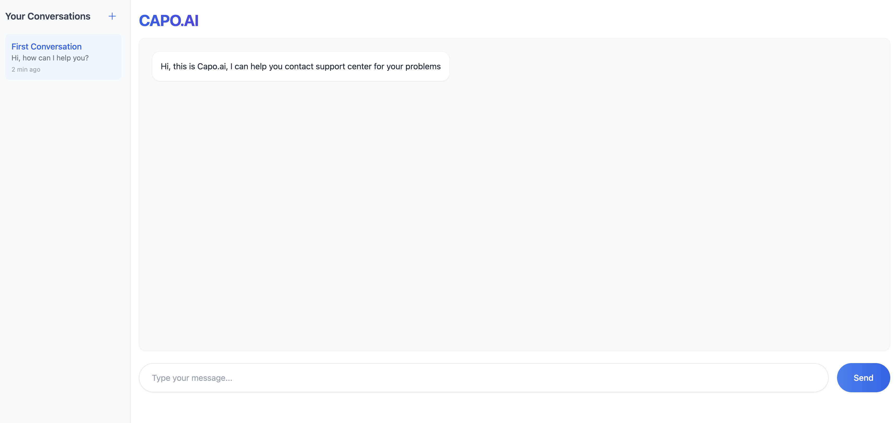

# CAPO AI

## Project Overview

Capo AI is a conversational assistant that impersonates a user in communication with customer support. It is built to talk with a Cognigy.AI agent using a REST API. To make it possible it uses OpenAI's GPT-4o to generate responses. In order to make the conversation as natural as possible, the assistant uses a context window that includes the conversation history and some instructions.

## Project Structure

The project is built with Node.js and uses the OpenAI API to generate responses. The main file is `index.ts` which is the entry point of the application. It defines the routes and starts the server.

The `src` folder contains the main logic of the application.

The `services` folder contains the logic for the OpenAI API and the Cognigy.AI API.

The `utils` folder contains utility functions.

The `types` folder contains the types for the project.

## Getting Started

1. Clone the repository
2. Install the dependencies
3. Start the different services and fill the `.env` file with the correct credentials
4. Run the application

## UI - AI Generated with v0

The UI was generated with v0. It is a simple UI that allows you to see the conversation history and the current conversation.

Sketch of the UI:

